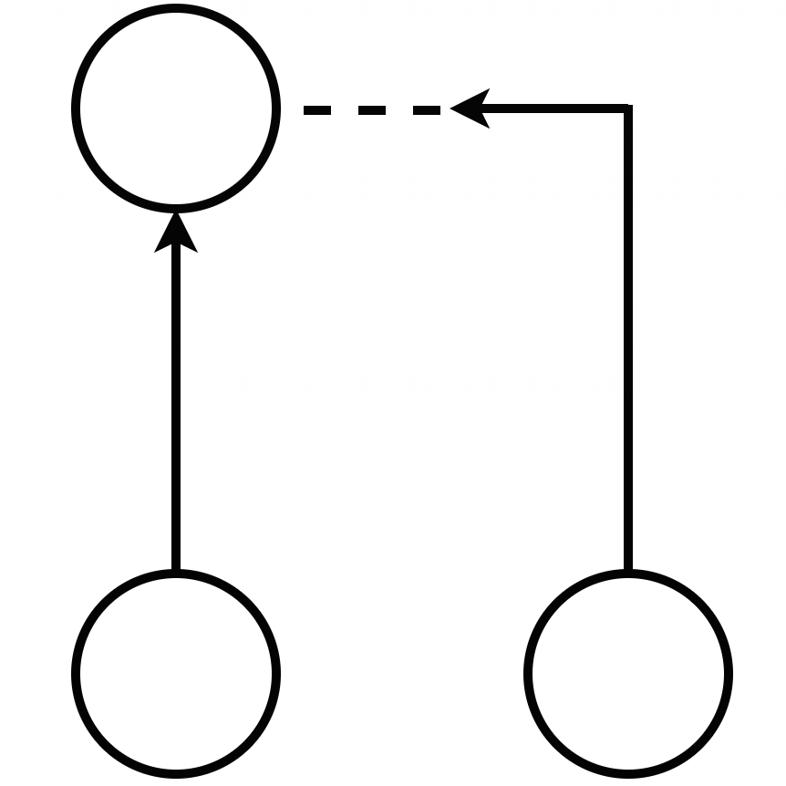

# PendingPR



A GitHub App built with [Probot](https://github.com/probot/probot) to help you manage issues that are in pull requests (PRs) better

## Usage

PendingPR assigns a _Pending PR_ label to an issue claimed to be closed by a PR in its
body. The label is then removed from the issue as soon as the PR is closed/merged. This
provides better visibility to you and your team on what issues are currently in PRs so you can focus
on what needs to be done instead!

For more infomation, check this GitHub article on [Closing issues using keywords](https://help.github.com/en/articles/closing-issues-using-keywords)

**Example:**

The following PR body would assign a _Pending PR_ label to issues _10_, _12_ and _15_ if they exist.

_This PR closes #10, resolves #12 and fixed: #15_

Once this PR is merged/closed, the _Pending PR_ label will be removed from these issues. The issues
are automatically closed by GitHub if the PR is merged.

### Notes

- PendingPR only assigns labels to open issues
- Reopening a closed PR will lead to _Pending PR_ label being assigned to issues mentioned in the
  body if the issues are still open
- Editing a PR's body and removing/adding issues from body will remove/add the label to
  those issues
- Labelling an issue in a different repository isn't supported yet

## Developer Setup

```sh
# Install dependencies
yarn install

# Compile TypeScript
yarn build

# Run the bot
yarn start

# Run for local development
yarn dev
```

## Contributing

If you have suggestions for how PendingPR could be improved, or want to report a bug, open an issue! We'd love all and any contributions.

For more, check out the [Contributing Guide](CONTRIBUTING.md).

## License

[ISC](LICENSE) © 2019 Danish Dua <danish@dandua.com> (https://github.com/dandua98/PendingPR)
